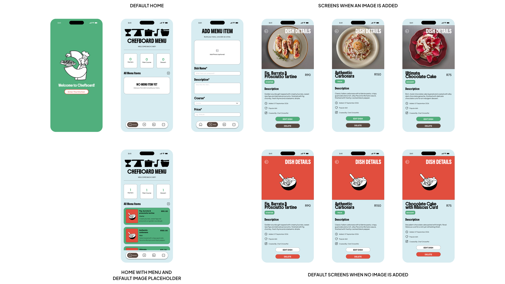

  

# ChefBoard App 

Chefs may create and review their menu items in one location with the help of **ChefBoard**, an easy-to-use mobile menu management application. Through a simple and appealing interface, the app ena[...]

## App Walkthrough Video

[ ✦ See What's Cooking ✦ ](YOUTUBE_VIDEO_LINK_HERE)

## Features

- **Add Menu Items** → Add a dish name, description, course, price, and optional dish photo.
- **View Menu Items** → View all saved dishes from the home screen.
- **Dish Details** → Open an individual dish to view its complete information.
- **Dish Photos** → Add an optional photo and display it on the menu and dish-details screens.
- **Course Categories** → Organize dishes as Starters, Main Courses, or Desserts.
- **Menu Overview** → View the number of dishes in each course and the total menu.
- **Temporary Clear Menu** → Remove all currently stored menu items with a confirmation prompt.
- **Simple Interface** → A clean visual layout designed for quick menu management.

##  Technical Stack

- React Native
- Expo
- Expo Router
- TypeScript
- React Native Safe Area Context
- React Native SVG
- Expo Image Picker

##  Main Screens

### Home

The home screen provides an overview of the chef's menu, including:

- Total number of menu items | starters, main courses and desserts
- List of all menu items
- Quick access to add a new dish
- Temporary option to clear the menu for testing purposes

### Add Menu Item

The add-menu screen allows the chef to enter:

- Dish name
- Description
- Course
- Price
- Optional dish photo

After saving, the new dish is added to the menu.

### Dish Details

The dish-details screen displays:

- Dish photo
- Dish name
- Price
- Course
- Description
- Date added
- Additional dish information
- Edit and delete actions | functionality with be added later on

###  Dish Photos 

ChefBoard supports optional dish photos. When adding a menu item, the chef can select a photo from the device using Expo Image Picker. 

The selected image is associated with the menu item and can be displayed on: 
- The Home screen 
- The Dish Details screen 

If no photo is selected, ChefBoard displays the default illustration instead.

###  Menu Data Menu 

Items are managed using `MenuContext.tsx`. 

Each menu item contains the following information: 
- Text 
- id 
- Dish Name 
- Description 
- Course 
- Price 
- Date Added 
- Image

## Design Considerations

ChefBoard was designed with simplicity, usability, and visual clarity in mind.

- **Simple Navigation |** The application uses a straightforward navigation structure so chefs can quickly move between the main sections of the app.
- **User-Friendly Interface |** Forms and buttons are clearly labelled to make adding and viewing dishes easy.
- **Visual Consistency |** A consistent colour palette, typography, spacing, and rounded UI elements are used throughout the application.
- **Responsive Layout |** The interface is designed to adapt to different mobile screen sizes.
- **Accessibility |** Clear text labels, sufficient contrast, and large interactive elements help improve usability.
- **Visual Feedback |** The application provides confirmation messages and visual feedback when users add menu items or perform important actions.
- **Dish Photography |** Chefs can optionally add photos to menu items, allowing dishes to be identified visually.
- **Error Prevention |** Required fields and validation help prevent incomplete or invalid menu items from being added.

## Screens

## Project Structure

## Future Improvements

ChefBoard will continue to be improved after the current version. Future development will be divided into short-term improvements and improvements required before the application is released on a[...]

### Short-term

- **Edit Menu Items |** Allow chefs to update existing dish information.
- **Delete Menu Items |** Allow individual menu items to be removed.
- **Search and Filtering |** Make it easier to find dishes by name, course, or other criteria.
- **Menu Statistics |** Provide useful statistics such as the number of dishes in each course category.
- **Persistent Data Storage |** Store menu items permanently so that data remains available after closing the application.
- **Improved Photo Management |** Allow chefs to replace, remove, and manage dish photos more easily.
- **Improved Form Validation |** Add stronger validation and clearer error messages when entering menu information. 
- **UI Improvements |** Refine layouts, spacing, animations, and responsiveness based on user feedback and testing.
- **Device Compatibility Testing:** Test the application across different screen sizes and supported devices.
- **Error Handling:** Add comprehensive error handling for unexpected problems and failed operations.

### Long-term

- **Menu Export |** Allow chefs to export their menus for sharing or printing.
- **Cloud Synchronization |** Synchronize menu data across multiple devices.
- **User Accounts |** Support individual chef accounts and personalized menus.
- **Menu Sharing |** Allow chefs to share menus digitally with customers or other staff members.
- **Advanced Analytics |** Provide more detailed insights into menu items and menu performance.
- **Security |** Protect user data and ensure that sensitive information is handled securely.
- **User Testing |** Conduct usability testing with potential users and implement improvements based on their feedback. 
- **App Store Preparation |** Prepare the application icon, screenshots, descriptions, promotional materials, privacy information, and other required store assets. 
- **Final Quality Assurance |** Conduct final testing to identify and resolve bugs before release.

## Author

**Lethabo Mohlala**

### Copyright

© 2026 Lethabo Mohlala. All rights reserved.

This project and its source code are intended for educational and project purposes. Unauthorized copying, redistribution, or commercial use of this project is not permitted without permission fro[...]
